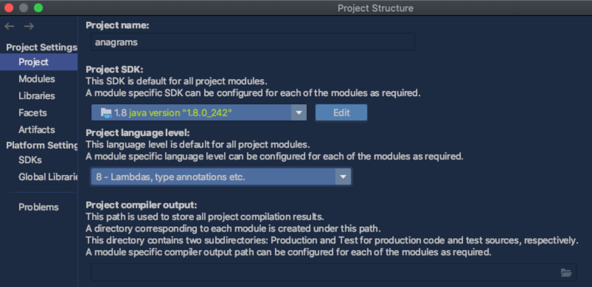
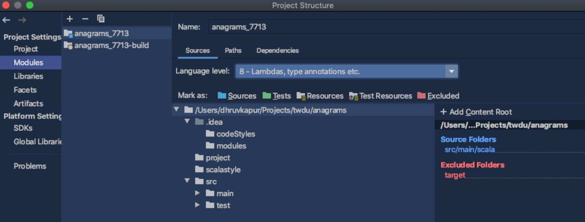

# Setup

It is important that we have Java 8 and not Java 11 when we are working with Spark 2.x versions. While we don't use Spark in this assignment, its useful to work towards the setup that will be eventually used. 
 
 Sidenote: Spark 3.x probably works with Java 11+, but we haven’t yet been able to test our content on Spark 3.x. So, we’ll be using Spark 2.x (preferably Spark 2.6) and will need to use Java 8.
 
 The java needs to be set up at a few places unfortunately. Ensure all of these apply - 
 
 1. At terminal, your java version points to java 8. 
 
 2. JAVA_HOME points to Java 8
 
 3. In Intellij, the project sdk and project language level uses Java 8.
  
 4. The Modules uses Java 8 language level
 
 5. Java 1.8 should be present as an SDK
 
 6. Ensure you have Scala sdk in Global libraries (and that matches with the Scala version in build.sbt)
 
 7. Build.sbt has Scala version 2.12.0 and that’s installed as one of the global libraries in Intellij.
 
 
It might be helpful to use `jenv` if you need to keep multiple java versions.  

______________
This assignment, you will solve the combinatorial problem of finding all the anagrams of a sentence using the Scala Collections API and for-comprehensions.

You are encouraged to look at the Scala API documentation while solving this exercise, which can be found here:

http://www.scala-lang.org/api/current/index.html

Note that Scala uses the String from Java, therefore the documentation for strings has to be looked up in the Javadoc API:

http://docs.oracle.com/javase/8/docs/api/java/lang/String.html

# The problem

An anagram of a word is a rearrangement of its letters such that a word with a different meaning is formed. For example, if we rearrange the letters of the word Elvis we can obtain the word lives, which is one of its anagrams.

In a similar way, an anagram of a sentence is a rearrangement of all the characters in the sentence such that a new sentence is formed. The new sentence consists of meaningful words, the number of which may or may not correspond to the number of words in the original sentence. For example, the sentence:

`I love you`

is an anagram of the sentence:

`You olive`

In this exercise, we will consider permutations of words anagrams of the sentence. In the above example:

`You I love`

is considered a separate anagram.

When producing anagrams, we will ignore character casing and punctuation characters.

Your ultimate goal is to implement a method **sentenceAnagrams**, which, given a list of words representing a sentence, finds all the anagrams of that sentence. Note that we used the term meaningful in defining what anagrams are. You will be given a dictionary, i.e. a list of words indicating words that have a meaning.

Here is the general idea. We will transform the characters of the sentence into a list saying how often each character appears. We will call this list the occurrence list. To find anagrams of a word we will find all the words from the dictionary which have the same occurrence list. Finding an anagram of a sentence is slightly more difficult. We will transform the sentence into its occurrence list, then try to extract any subset of characters from it to see if we can form any meaningful words. From the remaining characters we will solve the problem recursively and then combine all the meaningful words we have found with the recursive solution.

Let’s apply this idea to our example, the sentence `You olive`. Lets represent this sentence as an occurrence list of characters `eiloouvy`. We start by subtracting some subset of the characters, say i. We are left with the characters `eloouvy`.

Looking into the dictionary we see that i corresponds to word I in the English language, so we found one meaningful word. We now solve the problem recursively for the rest of the characters eloouvy and obtain a list of solutions List(List(love, you), List(you, love)). We can combine I with that list to obtain sentences I love you and I you love, which are both valid anagrams.
Representation

We represent the words of a sentence with the String data type:

```
type Word = String
```

Words contain lowercase and uppercase characters, and no whitespace, punctuation or other special characters.

Since we are ignoring the punctuation characters of the sentence as well as the whitespace characters, we will represent sentences as lists of words:

```
type Sentence = List[Word]
```

We mentioned previously that we will transform words and sentences into occurrence lists. We represent the occurrence lists as sorted lists of character and integers pairs:

    type Occurrences = List[(Char, Int)]

The list should be sorted by the characters in an ascending order. Since we ignore the character casing, all the characters in the occurrence list have to be lowercase. The integer in each pair denotes how often the character appears in a particular word or a sentence. This integer must be positive. Note that positive also means non-zero – characters that do not appear in the sentence do not appear in the occurrence list either.

Finally, the dictionary of all the meaningful English words is represented as a List of words:

```
val dictionary: List[Word] = loadDictionary
```

The dictionary already exists for this exercise and is loaded for you using the loadDictionary utility method.
Computing Occurrence Lists

The groupBy method takes a function mapping an element of a collection to a key of some other type, and produces a Map of keys and collections of elements which mapped to the same key. This method groups the elements, hence its name.

Here is one example:

```
List("Every", "student", "likes", "Scala").groupBy((element: String) => element.length)
```

produces:

```
Map(
      5 -> List("Every", "likes", "Scala"),
      7 -> List("student")
    ) 
```

Above, the key is the length of the string and the type of the key is Int. Every String with the same length is grouped under the same key – its length.

Here is another example:

```
List(0, 1, 2, 1, 0).groupBy((element: Int) => element) 
```

produces:

```
Map(
      0 -> List(0, 0),
      1 -> List(1, 1),
      2 -> List(2)
    ) 
```

Maps provide efficient lookup of all the values mapped to a certain key. Any collection of pairs can be transformed into a Map using the toMap method. Similarly, any Map can be transformed into a List of pairs using the toList method.

In our case, the collection will be a Word (i.e. a String) and its elements are characters, so the groupBy method takes a function mapping characters into a desired key type.

In the first part of this exercise, we will implement the method wordOccurrences which, given a word, produces its occurrence list. In one of the previous exercises, we produced the occurrence list by recursively traversing a list of characters. This time we will use the groupBy method from the Collections API (hint: you may additionally use other methods, such as map and toList).

```
def wordOccurrences(w: Word): Occurrences
```

Next, we implement another version of the method for entire sentences. We can concatenate the words of the sentence into a single word and then reuse the method wordOccurrences that we already have.

```
def sentenceOccurrences(s: Sentence): Occurrences 
```

# Computing Anagrams of a Word

To compute the anagrams of a word, we use the simple observation that all the anagrams of a word have the same occurrence list. To allow efficient lookup of all the words with the same occurrence list, we will have to group the words of the dictionary according to their occurrence lists.

```
lazy val dictionaryByOccurrences: Map[Occurrences, List[Word]] 
```

We then implement the method wordAnagrams which returns the list of anagrams of a single word:

```
def wordAnagrams(word: Word): List[Word] 
```

# Computing Subsets of a Set

To compute all the anagrams of a sentence, we will need a helper method which, given an occurrence list, produces all the subsets of that occurrence list.

```
def combinations(occurrences: Occurrences): List[Occurrences]
```

The combinations method should return all possible ways in which we can pick a subset of characters from occurrences. For example, given the occurrence list:

```
List(('a', 2), ('b', 2)) 
```

the list of all subsets is:

```
List(
      List(),
      List(('a', 1)),
      List(('a', 2)),
      List(('b', 1)),
      List(('a', 1), ('b', 1)),
      List(('a', 2), ('b', 1)),
      List(('b', 2)),
      List(('a', 1), ('b', 2)),
      List(('a', 2), ('b', 2))
    ) 
```

The order in which you return the subsets does not matter as long as they are all included. Note that there is only one subset of an empty occurrence list, and that is the empty occurrence list itself.

Hint: investigate how you can use for-comprehensions to implement parts of this method.
Computing Anagrams of a Sentence

We now implement another helper method called subtract which, given two occurrence lists x and y, subtracts the frequencies of the occurrence list y from the frequencies of the occurrence list x:

```
def subtract(x: Occurrences, y: Occurrences): Occurrences
```

For example, given two occurrence lists for words lard and r:

```
val x = List(('a', 1), ('d', 1), ('l', 1), ('r', 1))
    val y = List(('r', 1)) 
```

the `subtract(x, y)` is `List(('a', 1), ('d', 1), ('l', 1))`.

The precondition for the subtract method is that the occurrence list y is a subset of the occurrence list x – if the list y has some character then the frequency of that character in x must be greater or equal than the frequency of that character in y. When implementing subtract you can assume that y is a subset of x.

Hint: you can use foldLeft, and -, apply and updated operations on Map.

Now we can finally implement our sentenceAnagrams method for sequences.

```
def sentenceAnagrams(sentence: Sentence): List[Sentence] 
```

Note that the anagram of the empty sentence is the empty sentence itself.

Hint: First of all, think about the recursive structure of the problem: what is the base case, and how should the result of a recursive invocation be integrated in each iteration? Also, using for-comprehensions helps in finding an elegant implementation for this method.

Test the sentenceAnagrams method on short sentences, no more than 10 characters. The combinations space gets huge very quickly as your sentence gets longer, so the program may run for a very long time. However for sentences such as Linux rulez, I love you or Mickey Mouse the program should end fairly quickly – there are not many other ways to say these things.

# Further Improvement (Optional)

The solution with enlisting all the combinations was concise, but it was not very efficient. The problem is that we have recomputed some anagrams more than once when recursively solving the problem. Think about a concrete example and a situation where you compute the anagrams of the same subset of an occurrence list multiple times.

One way to improve the performance is to save the results obtained the first time when you compute the anagrams for an occurence list, and use the stored result if you need the same result a second time. Try to write a new method sentenceAnagramsMemo which does this.

# Test! Test! Test!

Add your own tests to double check that you’ve caught all corner cases.

You can also style check your by running styleCheck in the sbt shell.

__________
# Credits
This assignment has been taken from [CS 4240](https://heather.miller.am/teaching/cs4240/spring2018/assignments/1-anagrams.html), thanks for their work! 